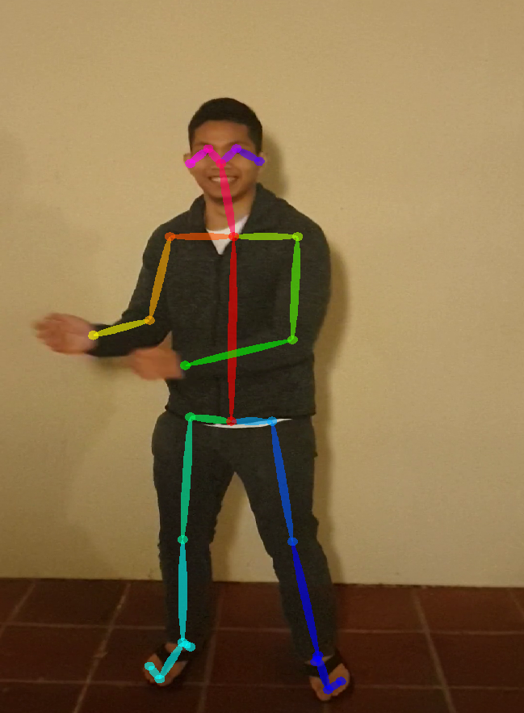
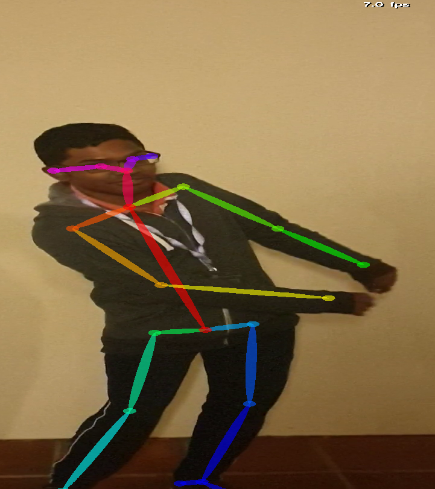

# Pose Matching through Dynamic Time Warping of Confidence-Weighted Cosine Similarity

## About
 
*Can we measure similarity between two videos of actors performing some movement?*

Given two videos of actors performing some movement, the goal of this project is to measure similarity between those two videos. This is done by comparing the delta in the angles between joints by measuring cosine similarity. One issue with only using cosine similarity is that two videos might have the same movement but may not start at the same time or have different speeds. To fix this problem, the shorter video is linearly interpolated to match the length of the longer video. After which, dynamic time warping is used to compute the shortest path along the distance matrix with rows being frames of the first video and columns being frames of the second. The length of the shortest path is then used as a dissimilarity measure.

## Input
- Examples of movements in JSON frames (each JSON file is a frame) can be found in the `data/raw` folder
- Pre-processed JSON files containing the coresponding pose coordinates will be found in the `data/posed` folder

## Usage
1. Clone this repo into the directory it will be imported from
```bash
git clone https://github.com/yourslab/pose-matching
```
2. Rename pose-matching into pose_matching because Python can't import packages with the `-` character
```bash
mv ./pose-matching ./pose_matching
```
2. Import the compare_dir wrapper function 
```python
from compare_dir import pose_matching
```
3. Each parameter in the compare_dir function takes as input a directory containing JSON frames outputted by [OpenPose](https://github.com/CMU-Perceptual-Computing-Lab/openpose)
```python
compare_dir('/path/to/json_frames_folder_a', 'path/to/json_frames_folder_b')
```

## Credits
- [OpenPose: Real-time multi-person keypoint detection library for body, face, hands, and foot estimation](https://github.com/CMU-Perceptual-Computing-Lab/openpose)
